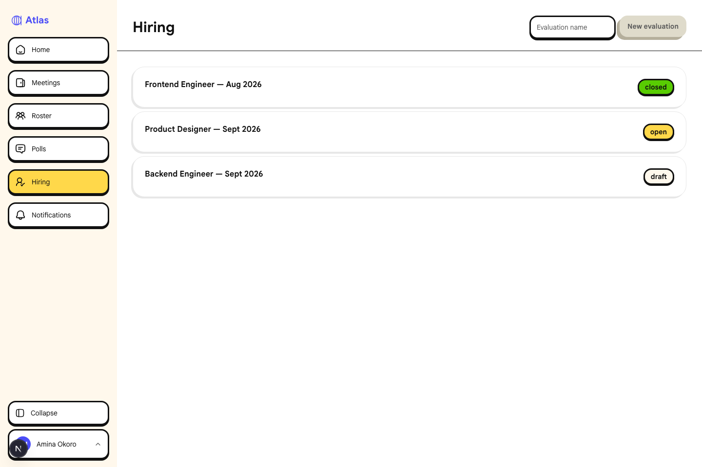
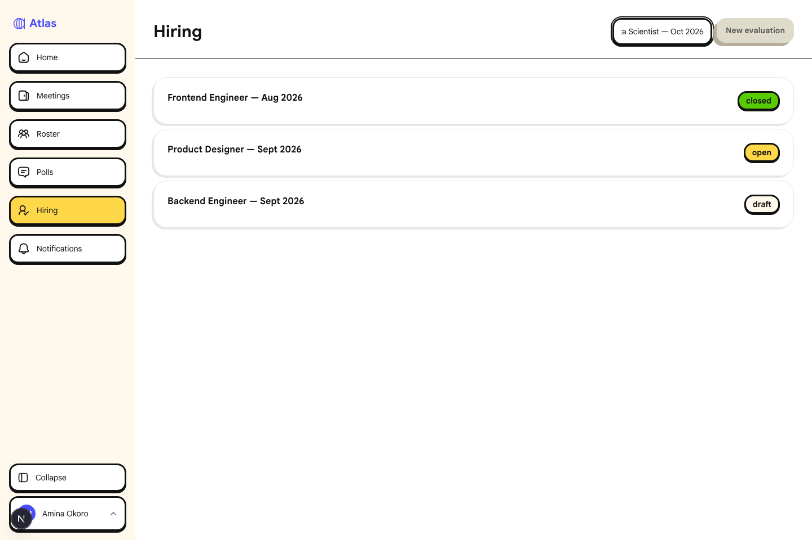
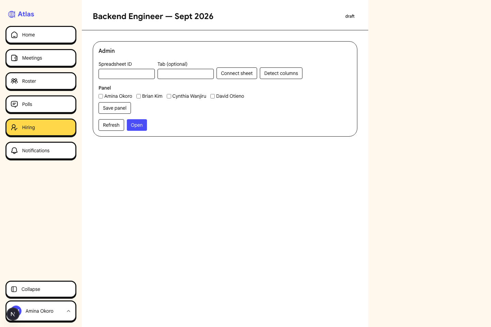
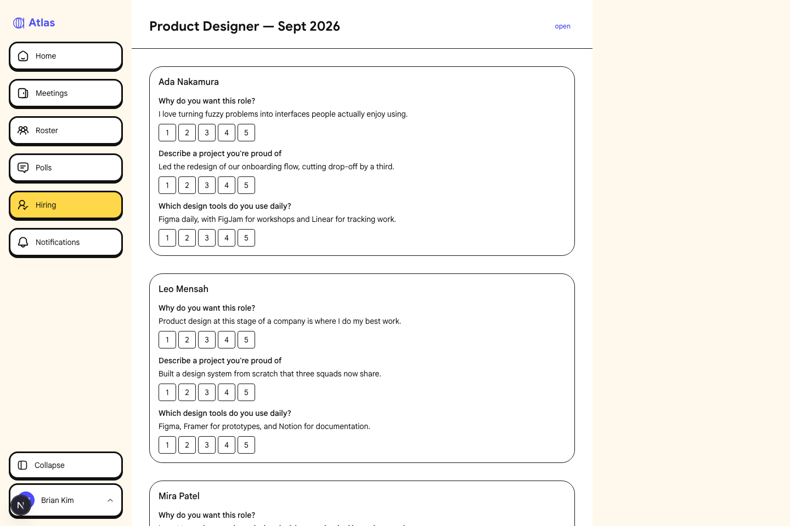
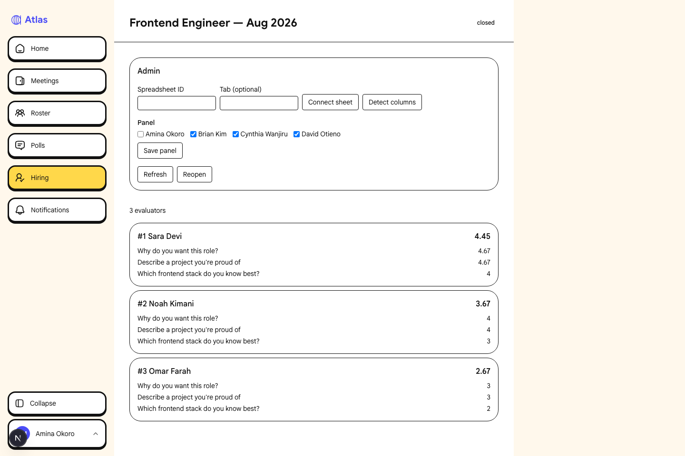

# Hiring evaluations — UI screenshots

Screenshots below are generated by `e2e/hiring-screenshots.spec.ts`, which seeds one evaluation in
each lifecycle state (`draft`, `open`, `closed`) via the Supabase service client and drives the app
as an admin and a panelist. Run `pnpm exec playwright test e2e/hiring-screenshots.spec.ts` to
regenerate them.

| Surface                               | Description (what it proves)                                                                                                                                                                                                            | Screenshot                                                                 |
| ------------------------------------- | --------------------------------------------------------------------------------------------------------------------------------------------------------------------------------------------------------------------------------------- | -------------------------------------------------------------------------- |
| Evaluations list (admin)              | `/hiring` lists all evaluations with their draft/open/closed status badges, and shows the admin-only "New evaluation" create control alongside the list.                                                                                |                            |
| Create evaluation form (admin)        | The inline name input and "New evaluation" submit button on `/hiring`, filled in but not yet submitted — the admin-only creation affordance.                                                                                            |              |
| Draft detail — admin controls         | `/hiring/{id}` for a draft evaluation: the Admin panel (spreadsheet connect, column detection, panel roster checkboxes, and the "Open" action) with no questions/candidates/results yet since the evaluation hasn't been opened.        |      |
| Open detail — rating panel (panelist) | `/hiring/{id}` for an open evaluation, viewed as a panelist: each candidate's answers to every question with the 1–5 scoring buttons, demonstrating the per-evaluator rating UI while the evaluation is live.                           |       |
| Closed detail — results               | `/hiring/{id}` for a closed evaluation: the ranked candidate list with overall and per-question averages and the "N evaluators" count, showing the aggregate reveal once ≥3 raters have scored every cell (results are not suppressed). |  |

## Not covered

The column-mapping dialog (`MappingDialog`, shown after "Detect columns" on a connected sheet)
requires a live Google Sheet reachable via `GOOGLE_SERVICE_ACCOUNT_JSON`, so it isn't screenshotted
here.
